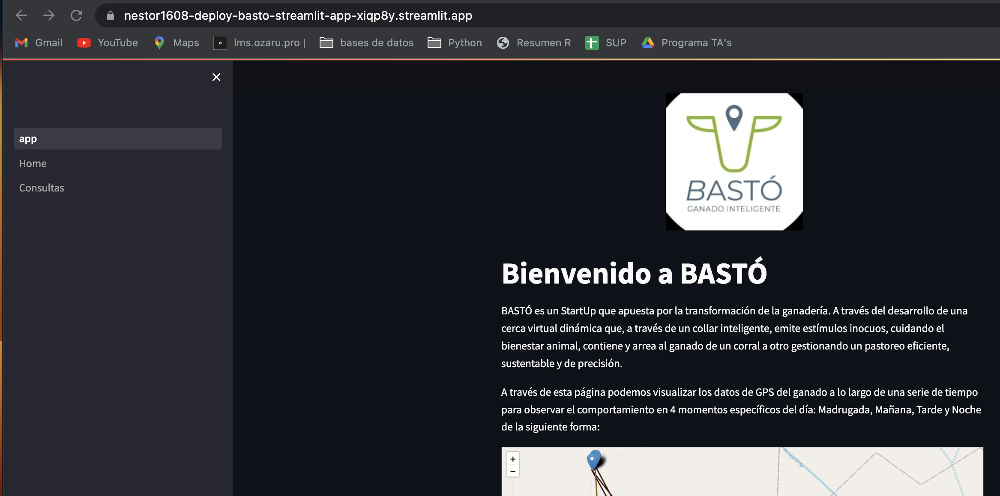
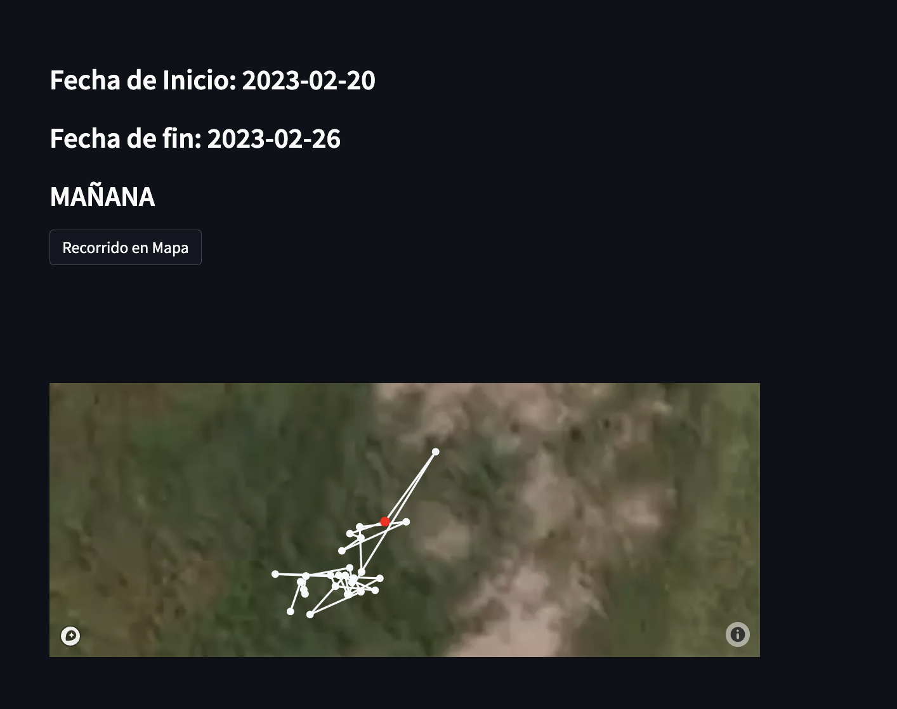

#  Proyecto BASTÓ

__BASTÓ__ es un StartUp que apuesta por la transformación de la ganadería. Han desarrollado una cerca virtual dinámica que, a través de un collar inteligente, emite estímulos inocuos, cuidando el bienestar animal, contiene y arrea al ganado de un corral a otro gestionando un pastoreo eficiente, sustentable y de precisión. 

Los dispositivos implementados en la empresa son los siguientes: 

__Collar__ → Éstos tienen una comunicación con centro de procesamiento de datos. Proveen información sobre localización cada 15 min, además de percibir la señal RSSI (decibeles) de las caravanas.

__Caravana__ → Proveen información de vacas cercanas a través de la proximidad al collar.

 

La tecnología utilizada en los dispositivos es: 

__Plataforma GPS__ → Datos geolocalización para conocer ubicación, desplazamiento y estimación de forraje.

__Plataforma BLE__ → Comportamiento animal.

 

## Henry Project

*Objetivo:*

A través de datos GPS y  información del ganado, determinar patrones de comportamiento de las vacas, a partir de los horarios, localización y índice de temperatura y humedad (ITH).

 

### Tareas a desarrollar:

* Investigación sobre comportamiento de ganado y los factores que pueden intervenir en el mismo. 
* Conexión con base de datos proveída.
* Limpieza y extracción de datos relevantes para su análisis 
* Exploración sobre distribución de los datos, valores nulos y duplicados.
* Visualización de puntos GPS.
* Creación de funciones para realizar consultas a la base de datos. 
* Deployment para visualización de consultas.

 

### Stack Tecnológico utilizado:

* MongoDB
* Python con librerias geopy, pymongo, pandas, geopandas, shapely, folium.
* Streamlit 
* Jira 
* Confluence 

 

## Investigación 

 
En general, las vacas tienen una distrución de 8 hrs en cada una de estas actividades: descanso, pastoreo y rumia. Sin embargo la distribución de estos tiempos depende de varios factores, entre los cuales destaca la calidad del pasto, condiciones climáticas, la ubicación de fuentes de agua y suplementos y la topografía del terreno.

En los datos que pudimos tener acceso se tenían 3 principales alimentos: centeno, grama rhodes y soja. La calidad de cada uno de ellos varía y puede impactar en la ingesta calórica por día. 

* En cuanto al valor energético del centeno en bovinos  se encontró que tiene una Energía Metabolizable (EM) de 2.8 Mcal por Kg de masa seca, bajo porcentaje de grasa (<1.5%) y aporta 9% de proteína 

* Grama Rhodes aporta 5.25% de proteína bruta con una digestibilidad de 43%. Además de aportar 1.7 Mcal por Kg de masa seca.

* En el caso del rastrojo de soja aporta 6.5% de proteína y es la opción cuando hay sequías. Tiene poco aporte nutricional pero es más fácil de mantener.

El tiempo que pasan las vacas en un espacio pastoreando nos puede dar un indicador de la calidad del alimento. A mayor tiempo en el espacio menor calidad y visceversa. 

 

En cuanto a las condiciones climáticas hay que tener en cuenta que cuando se registran temperaturas altas, los animales pastorean más en la noche que de día, además de registrarse una menor ingesta de alimento. 

Aproximadamente las vacas toman en promedio unos 20 litros diarios, en unas 4 veces al día. En temporada de altas temperaturas. Esto se ve modificado dependiendo de cuando el ganado se encuentra en pasturas jóvenes, pues contienen más agua que las pasturas de más edad. Es importante ubicar las zonas de aguadas también como una referencia para conocer las necesidades de la vaca si pasa mucho tiempo en el lugar donde obtiene agua. 

 

En un estudio (Cabezas, 2022) se observó que las conductas que más se observaban en un ganado eran: Pastoreo, Rumiación, Descanso en el pasto y estar paradas sin hacer algo relevante. Por lo tanto el tiempo que pasan en cada situación puede ayudarnos a predecir patrones en los que se mueve el ganado asociado a la localización de GPS que nos proporcionan los collares. 

 

## Visualización de datos 

Los datos GPS proveído por los collares es almacenado en una base de datos no relacional llamada MongoDB en la cual se van guardando documentos con información sobre las vacas, las caravanas con su señal en decibeles (RSSI), indicador ITH (Indicador de Temperatura Humedad), los asentamientos con sus límites establecidos, los dispositivos que se encuentran en funcionamiento para poder obtener más datos sobre el desplazamiento del ganado. 

 

Para manipular y visualizar los datos de manera más efectiva, se realizó una conexión con Python. Una vez que se tuvo la conexión se realizó una limpieza de los datos extrayendo la información relacionada a la localización de los collares en un potrero, quitando valores nulos o faltantes. La siguiente imagen muestra la localización de los puntos de GPS de 4 collares durante un día

 

Sin embargo la cantidad de registro por dispositivo no era constante a lo largo del periodo de tiempo que se manejaba en la base de datos con la que se estaba trabajando, por lo que se optó por visualizar a manera de gráfico de barras la cantidad de registros por semanas en el periodo proporcionado por lo que podría ser una guía sobre qué datos localizar para tener una mejor aproximación a las inferencias de los patrones que en conjunto las vacas realizan. Las semanas 13 y 14 son las que tienen la mayor cantidad de registros dentro de las vacas posicionadas en el potrero seleccionado anteriormente. 

 

## Funciones y consultas en Deployment: Streamlit 

 

Una vez teniendo la exploración inicial, se crearon funciones que realizan consultas a la base de datos extraida de MongoDB para conocer diferentes características del comportamiento del ganado durante el día, extraido del promedio de las semanas más relevantes. Se pueden consultar estos datos a través de la siguiente URL 

[Consultas BASTÓ](https://nestor1608-deploy-basto-streamlit-app-xiqp8y.streamlit.app/)

 

En la página podemos observar:

* Los filtros por asentamientos, por collar por medio de sus identificadores directos en la base de datos.
* Selección de la semana en la que se tienen registro. 
* Selección del momento del día.

Y dados esos filtros se muestra un mapa localizando las ubicaciones y los siguientes datos: 

* Distancia recorrida a lo largo del día
* Mapa de la distancia recorrida 
* Velocidad de movimiento en el pastoreo
* Tiempo de pastoreo
* Determinar vacas aisladas en un lapso de tiempo 

 

## API

 

Las consultas que se disponibilizaron en la API para las necesidades de la empresa fueron:

 

* Primer consulta: Informacion propia de una asentamiento.

* Segunda consulta: Informacion propia de una asentamiento en un periodo de tiempo.

* Tercera consulta: Toda la informacion de una vaca de un establecimiento

* Cuarta consulta: Días con más registros en la semana de una vaca en un establecimiento

* Quinta consulta: Toda la informacion de una vaca, en un establecimiento en una fecha

* Sexta consulta: Toda la informacion de una vaca, en un establecimiento en un periodo de tiempo

 

## Contacto de Equpo de trabajo 

| Miembro  | Github | Correo |
| ------------- | ------------- | ------------- |
| Renzo Marcelo Sosa  | https://github.com/Renzo96 | rensogonsales@gmail.com  |
| Franco Jose Ariel Laborde | https://github.com/FrancoJALaborde  | jose_ariel_franco@hotmail.com |
| Nestor Javier Gentil | https://github.com/nestor1608 | nestor_gentil@hotmail.com |
| Brandon Andrei Albornoz Lizarazo | https://github.com/AndreiGatoCB | baalbornozl@unal.edu.co |
| Ariatna Hernández Castillo | https://github.com/Arii95 | ariarana902@gmail.com

